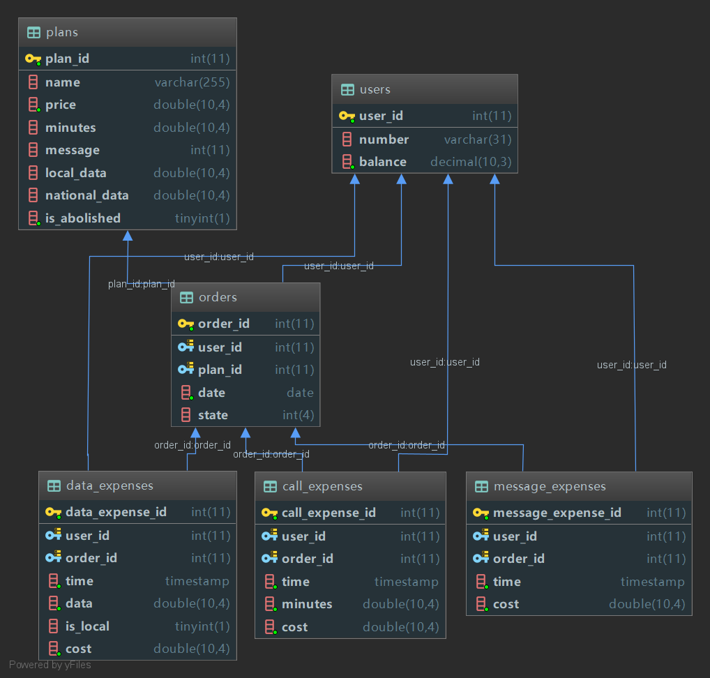

# 数据库作业——数据库设计

[TOC]

## 原始题目

#### 移动运营商业务数据库设计与实现

​	我们现在的生活与手机息息相关，而支撑起这一套复杂的移动通讯网络不光是硬件设备上的支持，后台系统也必须灵活而可靠。因此，作为系统重要的一环，运营商的数据库设计是一个相当大的挑战。请结合本课程相关内容深入理解，对某运营商A的移动网络业务数据库结构进行简要的设计，并完成以下问题：

1. 使用MySQL关系型数据库，设计所有相关的数据表。
2. 自行创建测试数据，进行如下操作：
  - 对某个用户进行套餐的查询（包括历史记录）、订购、退订（考虑立即生效和次月生效）操作
  - 某个用户在通话情况下的资费生成
  - 某个用户在使用流量情况下的资费生成
  - 某个用户月账单的生成
3. 相应操作请记录所用时间。
4. 回顾设计方案，简单谈一谈可能的优化思路（在说明文档中简要说明）。

#### 设计要求及参考

1. 资费
  - 基准资费
    - 通话费用：0.5元/分钟（仅拨打收费，接听免费）
    - 短信费用：0.1元/条
    - 本地流量费用（仅考虑4G流量）：2元/M
    - 国内流量费用（仅考虑4G流量）：5元/M
  - 优惠套餐参考
    - 话费套餐：月功能费20元，最多可拨打100分钟电话，超出时间按照0.5元/分钟计费。
    - 短信套餐：月功能费10元，最多可发送200条短信，超出条数按0.1元/条计费。
    - 本地流量套餐：月功能费20元，最多可获得2G流量，仅在本地使用，超出流量按2元/M计费。
    - 国内流量套餐：月功能费30元，最多可获得2G流量，超出流量按5元/M计费。
  - 套餐可自行设计
  - 考虑一个套餐中带有多种资费优惠类型
  - 考虑不同套餐叠加的情况
2. 网络服务地区
  - 考虑本地流量和国内流量在计费上的差别。

## 数据库ER图

## 操作设计

#### 1. 订购

- 设计：
- 运行截图：
- 时间：0.016s

#### 2. 退订（立即生效）

- 设计：
- 运行截图：
- 时间：0.01s

#### 3. 退订（次月生效）

- 设计：
- 运行截图：
- 时间：0.005s

#### 4. 查询套餐订购记录

- 设计：
- 运行截图：
- 时间：0.013s

#### 5. 生成通话资费

- 设计：
- 运行截图：
- 时间：0.021s

#### 6. 生成短信资费

- 设计：
- 运行截图：
- 时间：0.019s

#### 7. 生成流量资费

- 设计：
- 运行截图：
- 时间：0.015s

#### 8. 生成当月账单

- 设计：
- 运行截图：
- 时间：0.043s